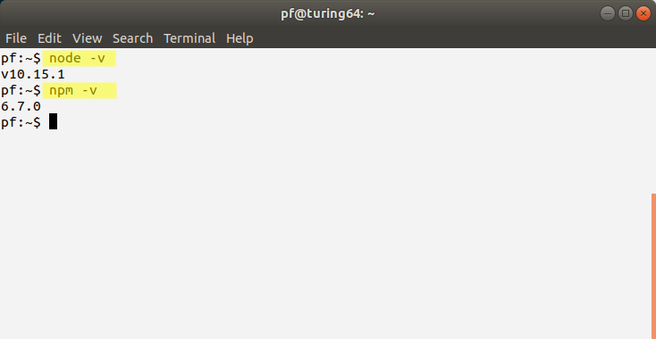
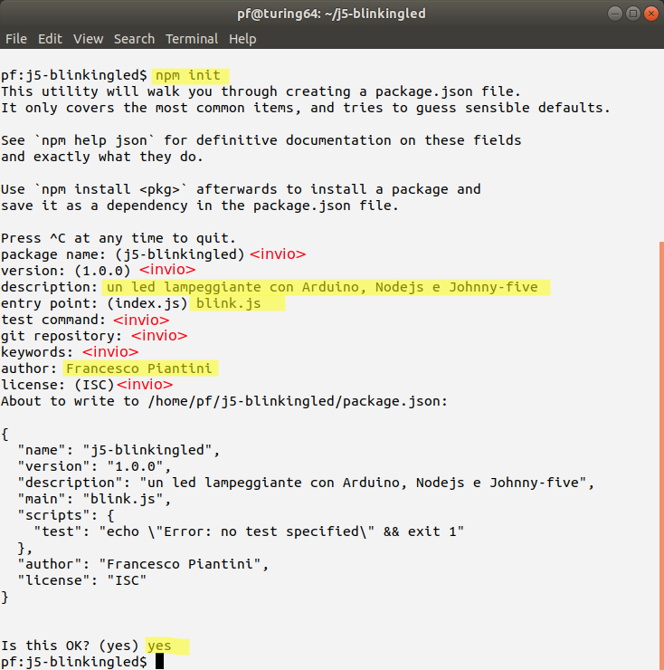
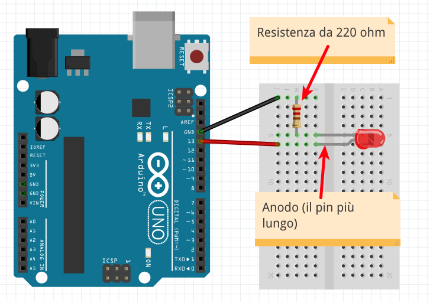

# Blinking Led
Un semplice circuito costruito e programmato con Arduino, NodeJS e Johnny-five.

## Introduzione

Se siete in possesso di una copia di questo tutorial avete probabilmente già visto il repository git del Coderdojo di Firenze contenente documentazione e codice per questo semplice ma divertente esercizio di tinkering e programmazione:
- https://github.com/coderdojofirenze/j5-blinkingled.git

Nel realizzare quanto descritto in questo tutorial potete utilizzare come base di partenza questo repository o, ancora meglio, partire da zero e realizzare tutto per conto vostro. Questo tutorial fa riferimento al secondo caso, tutto viene spiegato nel dettaglio in modo che possiate realizzare il tutto senza dover utilizzare git in nessun modo.

## Setup iniziale

Questo tutorial è stato provato con la scheda **Arduino Uno**, per cui nel resto della descrizione si farà riferimento ad una scheda di questo tipo, anche se è naturalmente possibile che il tutto funzioni anche con altre tipologie di schede.

E' necessario installare sul vostro PC:
- [La IDE di Arduino](https://www.arduino.cc/en/main/software)
- [NodeJS](https://nodejs.org/it/)

L'installazione di questi software dipende dal sistema operativo che avete sul vostro PC per cui non entreremo qui in troppi dettagli. Fate riferimento ai siti indicati e, se siete ad una sessione di Coderdojo, chiedete aiuto ai mentor.

Alla fine dell'installazione per verificare che Nodejs sia stato installato correttamente aprire un terminale, dare i comandi `node -v` e `npm -v` e verificare che rispondano con il numero di versione:



### Inizializzazione progetto Nodejs

A questo punto occorre inizializzare un nuovo progetto NodeJS. Il modo più semplice per farlo consiste nell'utilizzare il comando `npm init` dalla command line. Per fare questo utilizziamo il terminale che abbiamo aperto in precedenza, creiamo una directory dove mettere il nostro progetto, entriamoci e diamo il comando suddetto. In tutto dare i seguenti comandi:

```
mkdir j5-blinkingled
cd j5-blinkingled
npm init
```

Rispondere alle domande che appaiono sul terminale. In molti casi si può premere invio accettando la risposta proposta, in alcuni casi può essere utile scrivere qualcosa di diverso. Per esempio alla domanda `description:` si può rispondere **_"Un led lampeggiante con Arduino, Nodejs e Johnny-five"_**  e alla domanda `author:` si può rispondere con il proprio nome (e volendo con il proprio indirizzo email).

**Importante:** Alla domanda `entry point:` si deve rispondere con **_"blink.js"_**.

Alla fine, sul terminale dovrebbe apparire qualcosa di simile a quanto raffigurato nell'immadgine che segue.



Alla fine di questa operazione all'interno della nostra directory è stato creato un file testo di nome `package.json` che contiene tutte le informazioni del nostro progetto così come gliele abbiamo date. Se necessario è possibile modificarlo in qualsiasi momento.

### Installazione di johnny-five

**N.B: per completare questo passo è necessario disporre della connettività a internet.**

I progetti NodeJS utilizzano spesso delle librerie che aggiungono funzionalità all'ambiente di base. Queste si installano tramite il comando `npm install`. Nel nostro caso l'unica libreria necessaria è **Johnny-Five** (più tutti i componenti da cui dipende). Il tutto si installa tramite il comando:

```
npm install johnny-five --save
```

Alla fine di questa operazione, all'interno della directory di progetto è stata creata una directory `node_modules` che contiene tutte le librerie scaricate. Cosa più importante, nel file `package.json` è stata salvata l'informazione che il progetto dipende dalla libreria che abbiamo appena installato. Controllando si può infatti vedere che in questo file è stato aggiunto un blocco `"dependencies"` che contiene la riga `johnny-five`:

```json
  "dependencies": {
    "johnny-five": "^1.0.0"
  }
  ```

Tramite questa informazione, se per qualche motivo la directory `node_modules` venisse a mancare o risultasse corrotta è possibile scaricare nuovamente tutto il necessario tramite il semplice comando:

```
npm install
```

### Installazione Firmware su scheda Arduino

Collegare la scheda Arduino al PC utilizzando il cavo USB. Controllare che si accenda e che venga correttamente riconosciuta dalla IDE di Arduino: su quest'ultima controllare che **Board** e **Port** siano inizializzate correttamente e che la scheda risponda regolarmente al comando **Tools > Get Board info**.

A questo punto dobbiamo installare sulla scheda il firmware "Firmata", necessario per permettere a Johnny-Five di comunicare con la scheda stessa.

* Aprire il progetto "Standard Firmata" seguendo il menù: **File > Examples > Firmata > StandardFirmata**.
* Cliccare sul pulsante di **Upload**
* Aspettare finché sulla IDE non appare il messaggio **Done Uploading**

A questo punto la IDE può essere chiusa. Infatti non ci servirà più per tutta la durata del tutorial.

## Un primo led lampeggiante

Per ottenere un primo risultato e capire come funziona Johnny-Five scriviamo un primo programma che per funzionare non ha bisogno di realizzare nessun circuito. Infatti le schede Arduino dispongono di un led collegato direttamente sulla scheda che si controlla tramite la linea led numero **13**. Scriviamo quindi il seguente codice nel file di nome `blink.js`:

```javascript
// Un LED Lampeggiante

// Carichaimo la libreria 'johnny-five'
var five = require('johnny-five');

// Dichiariamo una scheda di tipo Arduino
var board = new five.Board();

// Dichiariamo una funzione che fa lampeggiare un led
// per sempre con un periodo di mezzo secondo.
board.on('ready', function() {
  var led = new five.Led(13);
  led.blink(500)
});
```

Per mandare in esecuzione il programma, dal terminale dare il seguente comando:

```
node blink.js
```

Dopo una fase iniziale di setup si può notare come il piccolo led vicino al connettore laterale più lungo della scheda Arduino (quello con accanto l'etichetta "L"), comincia a lampeggiare. Il nostro primo codice Javascript è adesso in esecuzione su una scheda a microcontrollore!

Per interrompere l'esecuzione del programma digitare i tasti "Ctrl-C" due volte.

## Un "vero" circuito

Per rendere più interessante il nostro esercizio possiamo realizzare un piccolo circuito collegando un "vero" led alla scheda. Realizziamo quindi il seguente circuito:



Il circuito è molto semplice. L'unico particolare a cui fare attenzione è la polarità del diodo LED. Il led infatti si accederà solo se è collegato nel giusto verso. In particolare l'**anodo** (riconoscibile perché è il pin più lungo) va collegato dal lato del pin 13 (opposto alla massa indicata come "GND" ossia ground). L'altro pin del LED si chiama **catodo**, va collegato verso la massa ed è riconoscibile anche per un piccolo taglio che c'è sul corpo del LED.

Adesso eseguiamo nuovamente il programma tramite il comando `node blink.js`. Adesso oltre al led sulla scheda lampeggerà anche il led che abbiamo montato noi.
